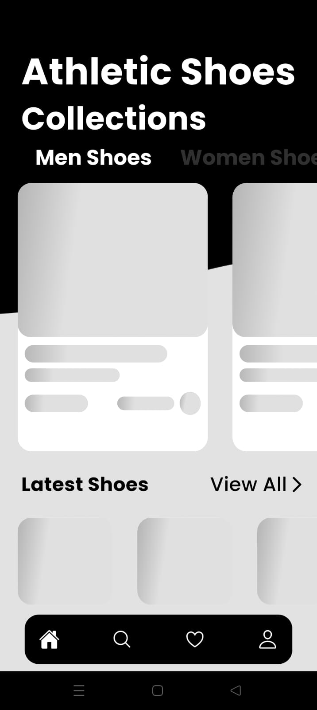
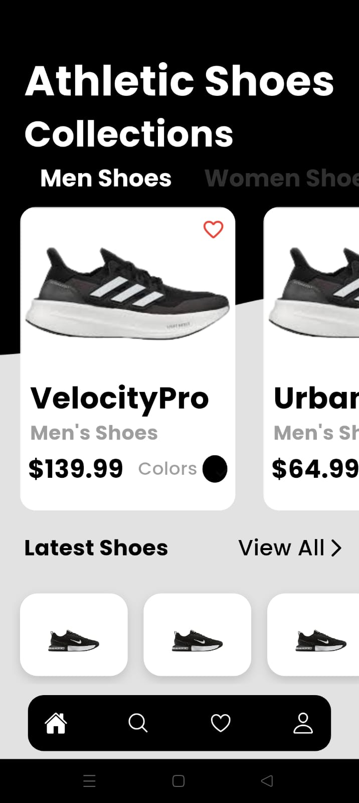
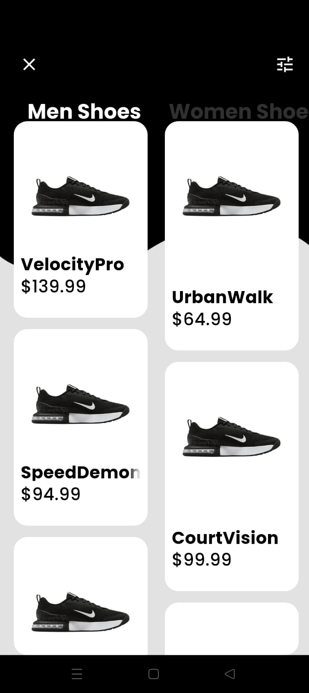
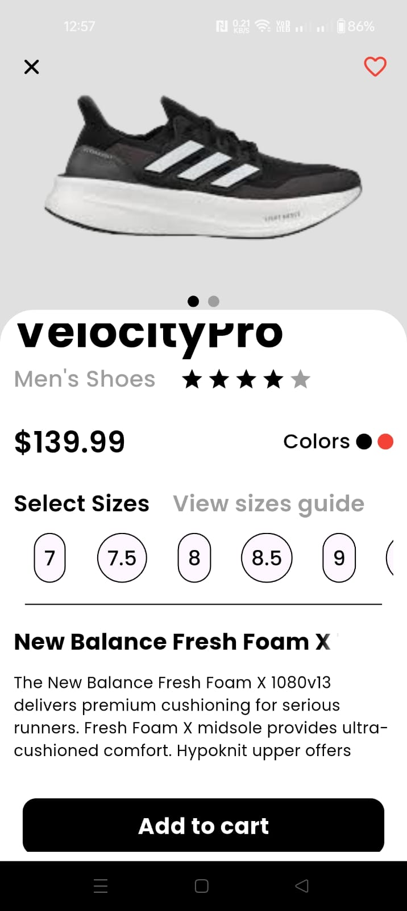
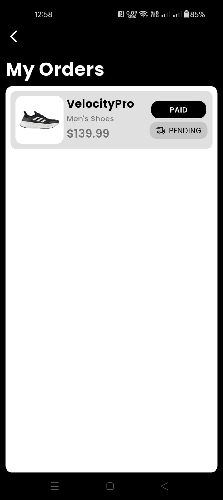
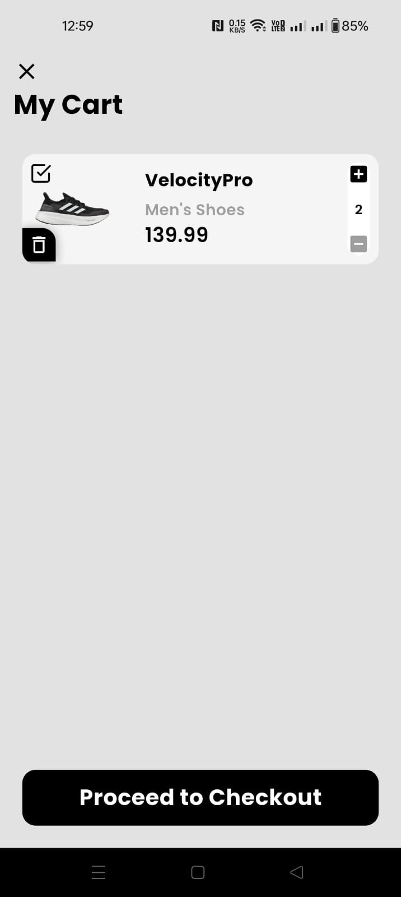
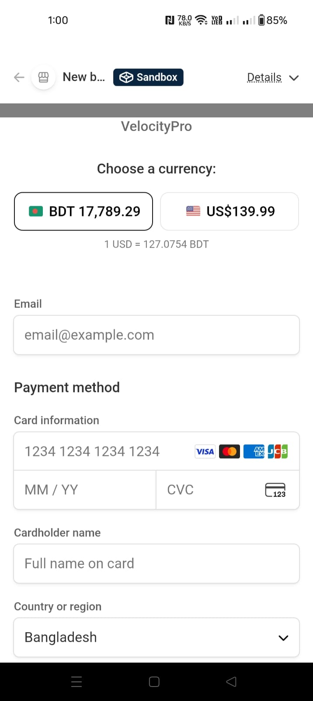
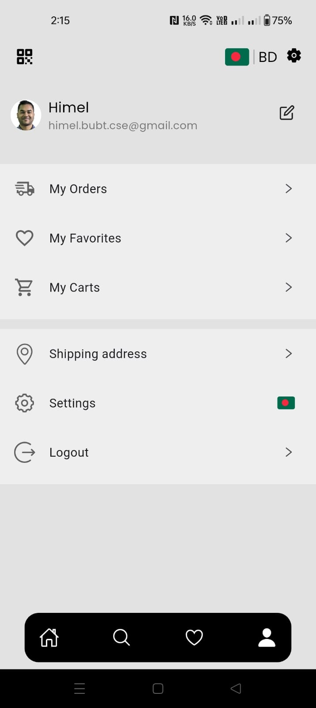

# 🛍️ Shop App — Flutter E-Commerce Application

A **full-stack Flutter e-commerce application** featuring product browsing, cart management, order processing, and secure Stripe payments.  
The system is powered by **two independent backend services** for scalability and security.

---

## ✨ Highlights

🛒 **Shopping Features**
- Product listing & details
- Category-based browsing
- Search functionality
- Favorites / wishlist
- Cart management
- Shipping address handling

📦 **Orders**
- Order creation
- Order history
- Order status tracking

🔐 **Authentication**
- User registration & login
- Secure API communication
- Token-based authentication

💳 **Payments**
- Stripe payment integration
- Dedicated payment backend
- Secure payment intent handling

⚙️ **Architecture**
- Clean, scalable folder structure
- MVC-inspired separation
- REST API-based backend communication

---

## 🧩 Backend Architecture

This project uses **two separate backend repositories**, each with a clear responsibility.

### 1️⃣ Shop App API (Main Backend)

🔗 **Repository:**  
👉 https://github.com/amhimel/shop-app-api

**Responsibilities**
- User authentication
- Product management
- Cart & order APIs
- Business logic
- Database operations

**Tech Stack**
- Node.js
- Express.js
- MySQL
- REST API

---

### 2️⃣ Payment Backend (Stripe)

🔗 **Repository:**  
👉 https://github.com/amhimel/payment_backend

**Responsibilities**
- Stripe payment intent creation
- Secure payment processing
- Payment confirmation & validation

**Tech Stack**
- Node.js
- Express.js
- Stripe API

---

## 📸 Screenshots

> Place screenshots inside a `screenshots/` folder in the repo root.

  
  
  
  
  

---

## 🎥 Demo

  

---

## 🧱 Tech Stack

### 📱 Frontend
- Flutter (Material 3)
- Dart
- Provider (State Management)
- REST API integration

### 🧠 Backend
- Node.js
- Express.js
- MySQL
- Stripe Payment Gateway

### 🔐 Security
- Token-based authentication
- Server-side Stripe keys
- Secure API endpoints

---

## 📁 Folder Structure

The app follows a **feature-oriented + MVC-like architecture**, keeping UI, logic, and data clearly separated.
<pre>
lib/
 ├── controllers/
 ├── models/
 ├── services/
 ├── views/
 │   ├── shared/
 │   └── ui/
 │       ├── auth/
 │       ├── cart/
 │       ├── orders/
 │       ├── payment/
 │       ├── product/
 │       ├── favorites.dart
 │       ├── home_page.dart
 │       ├── mainscreen.dart
 │       ├── non_user.dart
 │       ├── profile_page.dart
 │       ├── search_page.dart
 │       └── shipping_address.dart
 ├── app.dart
 └── main.dart
</pre>

---

## 🚀 Getting Started

### Prerequisites
- Flutter **3.x**
- Dart **3.x**
- Node.js **18+**
- MySQL
- Stripe account (test mode)

---

### 📲 Flutter App Setup

### bash
- git clone https://github.com/amhimel/shop-app.git
- cd shop-app
- flutter pub get
- flutter run

### 🌐 Backend Setup
##Shop App API
- git clone https://github.com/amhimel/shop-app-api.git
- cd shop-app-api
- npm install
- npm run dev
  
### Payment Backend
- git clone https://github.com/amhimel/payment_backend.git
- cd payment_backend
- npm install
- npm run dev

### 🤝 Contributing

Contributions are welcome!
If you’d like to improve UI/UX, performance, or features, please open an issue or submit a PR.

## 📝 License

MIT © 2026 — MD. ABDULLA AL MASUD HIMEL
